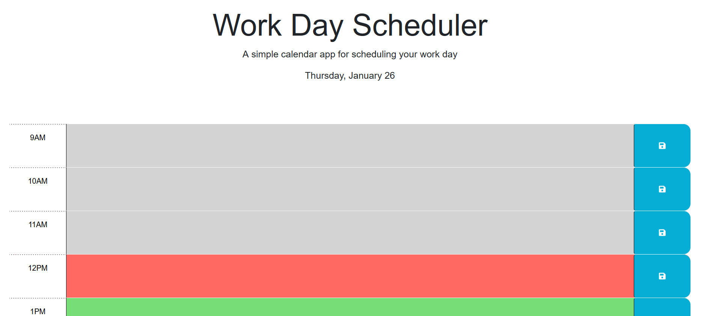

# calendar-plan

A simple calendar application that allows a user to save events for each hour of the day by modifying starter code. This app will run in the browser and feature dynamically updated HTML and CSS powered by jQuery.

## Description

This project was made to provide a simple daily planner that will save and display hourly events. Writing out a plan for the day can help you stay organized and on task. This planner can be updated daily, and will save your events even if you leave the page or close the window. While building this planner I became familiar with jQuery objects and Dayjs methods.

## Installation

To deploy the planner, simply visit the url: https://jubernst.github.io/calendar-plan/

## Usage

Enter your hourly tasks and press the save button to save them.

## Credits

https://github.com/Georgeyoo
